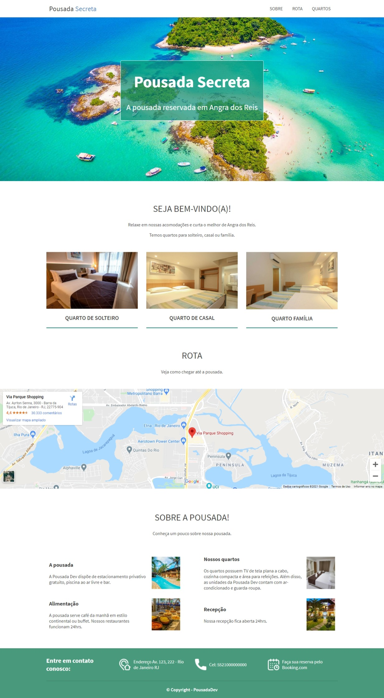

# Pousada Secreta

Este é um projeto de site para uma pousada fictícia, com o objetivo de demonstrar habilidades em **HTML5**, **CSS3** e **JavaScript** para criar uma página web responsiva, moderna e visualmente atraente.

---

### Tecnologias Utilizadas

O projeto foi desenvolvido utilizando as seguintes tecnologias:

- **HTML5**: Para estruturar o conteúdo da página de forma semântica.
- **CSS3**: Para estilização completa, layout responsivo e animações.
- **JavaScript**: Para funcionalidades interativas, como o menu de navegação responsivo e animações de rolagem.
- **Google Fonts**: Para importar a tipografia `Source Sans Pro`.
- **Font Awesome**: Para os ícones sociais e de serviços.

---

### Funcionalidades do Site

- **Layout Responsivo**: O site se adapta a diferentes tamanhos de tela, proporcionando uma ótima experiência em dispositivos móveis e desktops.
- **Menu de Navegação Fixo**: O menu permanece no topo da tela, facilitando a navegação.
- **Efeitos Visuais**: Utilização de gradientes, `backdrop-filter` (efeito de "vidro fosco") e animações suaves ao rolar a página.
- **Cards de Informações**: Seções bem organizadas para apresentar os quartos, localização e serviços da pousada.
- **Integração com Mapa**: Mapa incorporado na seção de localização para guiar os visitantes.

---

### Demonstração

Veja abaixo algumas capturas de tela do projeto:

<div align="center">
  
</div>

---

### Como Rodar o Projeto

1.  Clone este repositório para o seu computador.
    ```bash
    git clone https://github.com/fau-33/pousada-web
    ```
2.  Abra o arquivo `index.html` no seu navegador de preferência.
